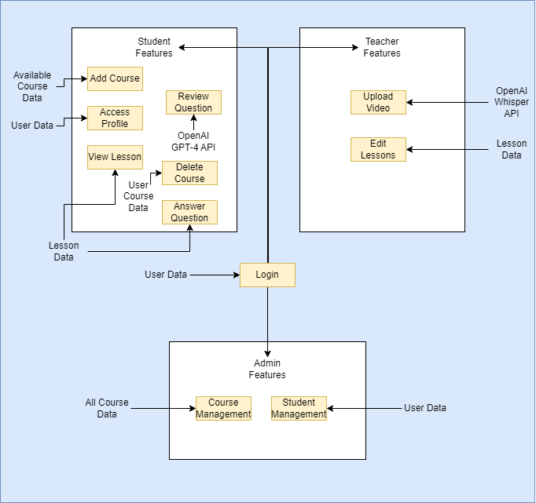
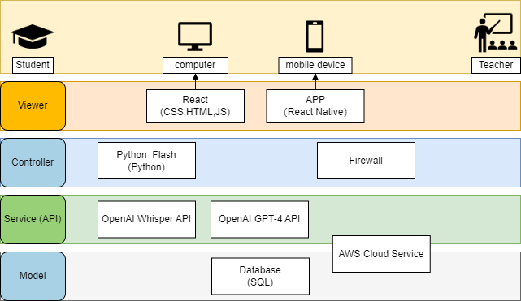
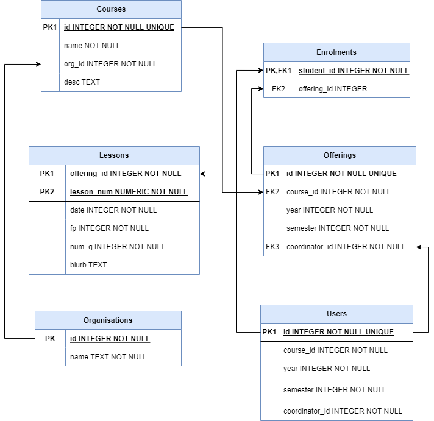
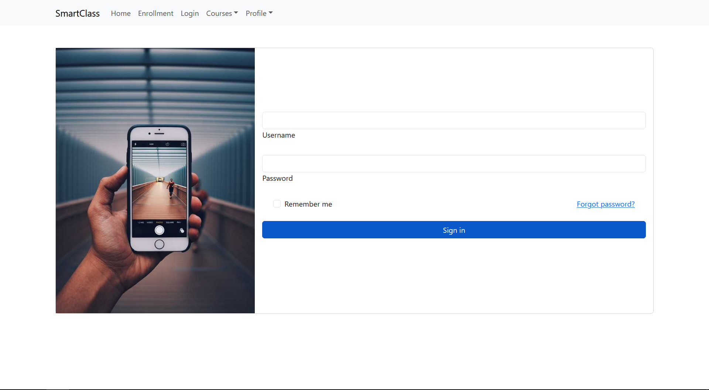

# SmartClass: Requirement Specification 2

# 1 - Introduction

## 1.1 - Project Objectives
Currently, online teaching has emerged as the most popular method of instruction. The project's overarching goals encompass the following objectives:

1. Enhancing students' understanding of the content through regular assessments tailored to their needs.
2. Empowering teachers to create diverse and engaging learning experiences for their students.
Streamlining the development of online learning tools, thereby freeing up teachers' time to provide support to students facing challenges.
3. Facilitating real-time monitoring of students' progress, enabling teachers to track their growth dynamically.
4. By implementing these objectives, the project aims to leverage the benefits of online teaching, ensuring deeper comprehension, personalized instruction, efficient resource allocation, and effective student progress tracking.

## 1.2 - Definition of terms
| Term     | Definition                                                                            |
| -------- | ------------------------------------------------------------------------------------- |
| AI       | Artificial Intelligence                                                               |
| GPT      | Generative Pre-trained Transformer                                                    |
| OS       | Operating System                                                                      |
| UQ       | University of Queensland                                                              |
| Course   | A collection of lectures, tutorials and assessments intended to teach students        |
| Offering | A particular run of a course, in a particular year and semester                       |
| Semester | A particular division of a year (e.g, semester 2 in an organization with 3 semesters) |

## 1.3 - Scope of application
This document is intended to be useful for a wide range of individuals, including project team members, students, teachers, and other pertinent stakeholders.

# 2 - Overview of overall design

## 2.1 - Target task
The design goal of the SmartClass application is to significantly simplify the process of creating lesson revisions for teachers, leveraging cutting-edge artificial intelligence technologies.

The primary objective of the AI education system is to transform pre-recorded videos into actionable quiz questions that effectively assess students' comprehension of the content. This requires careful consideration of suitable AI software, as well as an assessment of technological and operational requirements.

To achieve this, the SmartClass application will perform the following key tasks:

Convert pre-recorded videos into easily readable text format.
Utilize AI to generate relevant and informative questions based on the converted text, while also retrieving corresponding answers.
Employ AI to evaluate answers provided by students, providing constructive feedback in case of incorrect responses.
In instances where a student consistently answers questions incorrectly, guide them towards prerequisite classes or lessons that facilitate improvement or relearning of the necessary knowledge.
The lessons within the SmartClass application can be structured using a "knowledge network" approach, wherein relevant prerequisite knowledge is interconnected with each question, ensuring a comprehensive and coherent learning experience.

## 2.2 - Design strategy
The system adopts a secure MVC (Model-View-Controller) software architectural pattern by leveraging React, Python Flask, and SQLite3. This combination enables clear separation of front-end, back-end, and data functionalities. React serves as the front-end framework, Python Flask handles the back-end logic, and SQLite3 is utilized for data management. This approach ensures robust architecture while maintaining security and promoting scalability.

## 2.3 - Conditions and restrictions
This document solely focuses on category descriptions and listings. For detailed project specifications, please refer to the requirements-spec document.

1. The application extensively utilizes AI, particularly relying on the OpenAI GPT-4 API to ensure the accuracy of answers.
2. Average response time: Teachers may experience longer lesson generation times depending on the length of the content provided. Conversely, students should receive answers within a response time of less than 1 minute.
3. Presently, the application is primarily designed for school use, tailored specifically to meet educational needs. While other use cases may not be optimal at this time, the consideration of alternative use cases is planned for future iterations.

## 2.4 - Design principles
Our software will adhere to Nielsen's Heuristic Design Heuristics. Here's how we will incorporate each principle:

1. Visibility of System: Our system will provide users with timely feedback to keep them informed. We will achieve this by highlighting the user's selected object and providing clear indicators during website loading.

2. Match between system and real world: Our design will use familiar language and jargon that resonates with users. By incorporating school-related terms and creating a "knowledge network," we will recreate the school environment and facilitate learning.

3. User control and freedom: We will empower users with mistake-prevention actions, such as confirmation pop-ups and undo functionalities.

4. Consistency and standards: Our application will adhere to industry standards that schools require, ensuring consistency and familiarity for users.

5. Error prevention: We will proactively reduce the likelihood of errors through careful design and implementation.

6. Recognition rather than recall: Our website will display relevant elements, actions, and options at all times, minimizing the need for users to rely on memory recall.

7. Flexibility and efficiency of use: To accommodate both inexperienced and experienced users, our system will provide shortcuts that cater to different skill levels.

8. Aesthetic and minimalist design: We will maintain a clean and minimalist interface, focusing on displaying only essential information to prevent user distractions.

9. Help users recover from errors: Our error messages will be user-friendly, clearly indicating the problem and providing meaningful guidance for recovery.

10. Help and documentation: While we aim to keep our application intuitive enough to minimize reliance on help and documentation, we will provide this document as a resource. Additionally, users can access direct help from our team through workshops and other channels.
    
# 3 - Development and operation environment
| Server    | Main Configuration | OS    | Purpose     | Middleware | Number |
| --------- | ------------------ | ----- | ----------- | ---------- | ------ |
| PC Server | 4C/16GB, 100GB     | Linux | Database    | Nothing    | 1      |
| PC Server | 4C/16GB, 1000GB    | Linux | Application | Nothing    | 1      |

# 4 - Overall system architecture

## 4.1 - Functional architecture
<figcaption for="1"> <b>Figure 1</b>: Functional Architecture </figcaption>
<figure id="1" style="display:flex;justify-content:center;">
    
</figure>

## 4.2 - Technical architecture
<figcaption for="2"> <b>Figure 2</b>: Technical Architecture </figcaption>
<figure id="2" style="display:flex;justify-content:center;">
    
</figure>

## 4.3 - Deployable architecture

## 4.4 - Related system integration relationship
### 4.4.1 - Student                                                   
| Interface function description | Expected interface element (input)                 |
| ------------------------------ | -------------------------------------------------- |
| Access profile                 | Input: username (stored within session)            |
|                                | Output: basic user information related to username |
| Enrol courses                  | Input: course name, course study period, username  |
|                                | Output: courseID, status completion                |
| Drop courses                   | Input: course name, course study period, username  |
|                                | Output: status completion                          |
| Receive feedback               | Input: answer, username                            |
|                                | Output: AI response                                |
| Get course information         | Input: course name                                 |
|                                | Output: course description                         |
| Answer question                | Input: questionID, response                        |
|                                | Output: receive feedback                           |
| View lesson                    | Input: LessonID                                    |
|                                | Output: Lesson Content                             |
### 4.4.2 - Teacher
| Interface function description | Expected interface element (input)                                                                                                               |
| ------------------------------ | ------------------------------------------------------------------------------------------------------------------------------------------------ |
| Upload videos                  | Input: video file (mp4)                                                                                                                          |
|                                | Output: success message                                                                                                                          |
| Create lesson                  | Input: CourseID, video file (uploaded)                                                                                                           |
|                                | Output: success message                                                                                                                          |
| View lesson                    | Input: CourseID, LessonID, username                                                                                                              |
|                                | Output: Lesson contents, settings to edit                                                                                                        |
| Edit lesson                    | Input: CourseID, LessonID, Content (changed), Content (original)                                                                                 |
|                                | Output: Lesson contents, with content changed. (transcript or questions). If transcript is changed, the AI will automatically fix the questions. |

# 5 - Database design

## 5.1 - Database environment description
1. Hardware environment
CPU: 8C
Memory: 16GB
Hard disk: 1000G 
Network: 1000M network card

2. Software environment
Database: SQLite
Operating system: Linux

3. Software environment
Service: AWS Cloud Services (Master-slave replication) (synchronous update)
Database: MongoDB 

## 5.2 - Database naming rules

| Structure                            | Explanation                                                                  | Field        | Example                   |
| ------------------------------------ | ---------------------------------------------------------------------------- | ------------ | ------------------------- |
| Alpha prefix, numeric suffix         | Typical structure for courseID                                               | courseID     | CSSE3880, CS50            |
| date: YYYY-MM-DD                     | SQLite limitation, no date type                                              | date         | 2023-07-03                |
| ./{courseID}-YYYY-{semester}/lessonN | location where files will be stored                                          | fp           | ./COMP4500-2023-2/lesson4 |
| alpha, '-'                           | Users cannot add spaces to their first and last name, prevents SQL injection | fname, sname | McNeilly-Yu               |

## 5.3 - Database table structure description
<figcaption for="5"> <b>Figure 5</b>: ER diagram of database </figcaption>
<figure id="5" style="display:flex;justify-content:center;">
    
</figure>

# 6 - Interface design

## 6.1 - External interface
The external interface of our system encompasses two main user roles:

Teachers: Teachers have the ability to upload videos, edit transcripts, and review and modify questions that may contain generative mistakes from the AI. This enables them to maintain control over the content and ensure its accuracy.

Students: Students can access the uploaded lessons created by teachers and actively participate by answering questions related to the lesson. They will also receive feedback based on their responses, helping them gauge their understanding and progress.

## 6.2 - Internal interface
The internal interface of the attendance system is designed to facilitate seamless communication between the front-end application module and the back-end service. This interaction is achieved through REST APIs, which establish a structured and standardized approach for data exchange.

By utilizing this internal interface access mode, the system achieves a clear separation and decoupling of front-end and back-end components. This architectural design promotes modularity, flexibility, and maintainability, allowing for independent development and updates of both the front and back-end aspects of the system.

# 7 - Detailed Design

## 7.1 - Log-In Page

### 7.1.1 - Functional Description
> A one-sentence description of the feature

The user logs into the system and authenticates themselves to use the other functionality on the site.

### 7.1.2 - Interface Design
<figure>
    
</figure>

### 7.1.3 - Logical Process
> Sentences explaining the flow of using the UI

1. The user navigates to the site.
2. The user enters their user id into the username field.
3. The user enters their password in the password field.
4. The user presses the "Sign in" button"

### 7.1.4 - Entry
- What the user enters into the UI

| Name     | Type    | Check Rules         | Control Type | Source     |
| -------- | ------- | ------------------- | ------------ | ---------- |
| Username | integer | Required by default | nothing      | Login form |
| Password | string  | Required by default | alphanumeric | Login form |

### 7.1.5 - Output Item

| Name    | Type    | Description                                                                                     |
| ------- | ------- | ----------------------------------------------------------------------------------------------- |
| Success | Boolean | A boolean indicating whether the user has successfully authenticated themselves into the system |

### 7.1.6 - Program Implementation Design

#### 7.1.6.1 - Package Design
> Imports

| Package Name     | Description                                     |
| ---------------- | ----------------------------------------------- |
| mdb-react-ui-kit | JavaScript Bootstrap                            |
| AuthContext      | Custom context to save user ID across all pages |
| react            | React library                                   |
| react-router-dom | React library for routing                       |

#### 7.1.6.2 - Class Design
> Components this page uses.

| Class Name   | Description                                          |
| ------------ | ---------------------------------------------------- |
| useState     | State variable hook for JS functional components     |
| useNavigate  | Allows the user to be redirected to a different page |
| useAuth      | Custom authentication global state variable          |
| MDBBth       | Bootstrap button component                           |
| MDBContainer | Bootstrap container component                        |
| MDBCard      | Bootstrap card component                             |
| MDBCardBody  | Bootstrap card body component                        |
| MDBCardTitle | Bootstrap card title component                       |
| MDBRow       | Bootstrap row component                              |
| MDBCol       | Bootstrap column component                           |
| MDBInput     | Bootstrap input component                            |
| MDBCheckbox  | Bootstrap checkbox component                         |

### 7.1.6.3 - Database Design
| Table Name | Description                        |
| ---------- | ---------------------------------- |
| Users      | The table containing all user data |

## 7.2 - View Video Page

### 7.2.1 Functional Description
> A one-sentence description of the feature

### 7.2.2 - Interface Design
<figure>
    
</figure>

### 7.2.3 - Logical Process
> Sentences explaining the flow of using the UI

### 7.2.4 - Entry
- What the user enters into the UI

| Name | Type | Check Rules | Control Type | Source |
| ---- | ---- | ----------- | ------------ | ------ |
|      |      |             |              |        |

### 7.2.5 - Output Item

| Name | Type | Description |
| ---- | ---- | ----------- |
|      |      |             |

### 7.2.6 - Program Implementation Design

#### 7.2.6.1 - Package Design
> Imports

| Package Name | Description |
| ------------ | ----------- |
|              |             |

#### 7.2.6.2 - Class Design
> Components this page uses.

| Class Name | Description |
| ---------- | ----------- |
|            |             |

### 7.2.6.3 - Database Design
| Table Name | Description |
| ---------- | ----------- |
|            |             |

## 7.3 - View current course

### 7.3.1 - Function description
Students can view their current enrolled courses and access their course details directly, the course actually shows a general description of the course.

### 7.3.2 - Interface design

### 7.3.3 - Logical process
1. The user is redirected to this page from login.
2. The user is given the courses that they are enrolled in.
3. Pressing the course gives further details associated.
4. The user presses the view button for the course.

### 7.3.4 - Entry 
| Name     | Type    | Check Rules | Control Type | Source   |
| -------- | ------- | ----------- | ------------ | -------- |
| courseID | Integer | UNIQUE      | nothing      | database |

### 7.3.5 - Output Item
| Name        | Type | Description                                      |
| ----------- | ---- | ------------------------------------------------ |
| redirection | URL  | redirects you to the corresponding courseID page |

### 7.3.6 - Program Implementation Design

#### 7.3.6.1 - Package Design
| Package Name     | Description                                     |
| ---------------- | ----------------------------------------------- |
| mdb-react-ui-kit | JavaScript Bootstrap                            |
| AuthContext      | Custom context to save user ID across all pages |
| react            | React library                                   |
| react-router-dom | React library for routing                       |

#### 7.3.6.2 - Class Design
| Class Name | Description                                                                          |
| ---------- | ------------------------------------------------------------------------------------ |
| useState   | State variable hook for JS functional components                                     |
| useEffect  | JS functional components that does something when the state variable changes.        |
| Accordion  | Bootstrap component that creates a functioning accordion to show/hide course details |
| Container  | Bootstrap component that creates a functioning container for general bootstrap use.  |
| Spinner    | Bootstrap component that creates a spinner for when requests are loading.            |

# References
Nielsen, J., & Molich, R. (1990). Ten Usability Heuristics. In: Nielsen Norman Group. [Online] Available at: https://www.nngroup.com/articles/ten-usability-heuristics/ (Accessed: 30 June 2023).
 